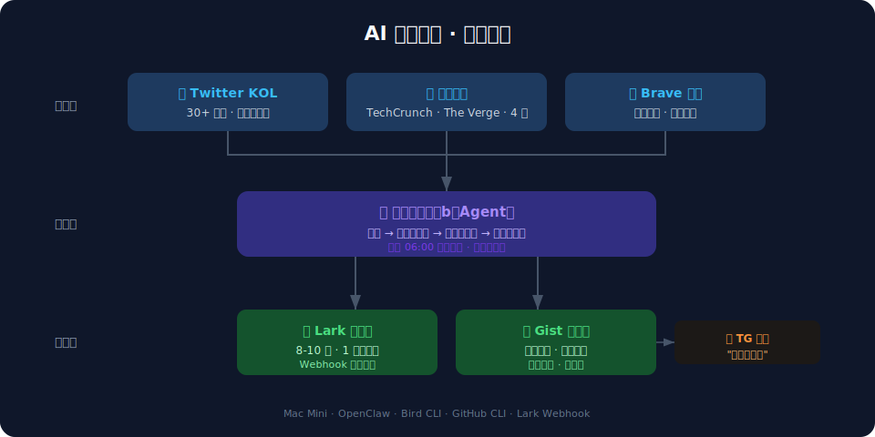
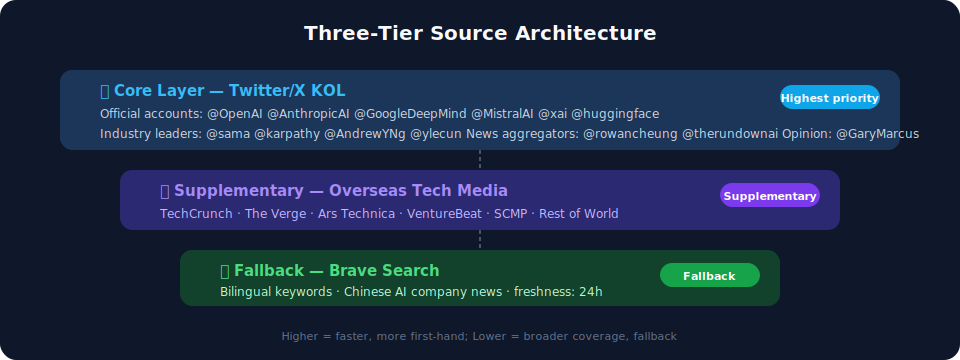
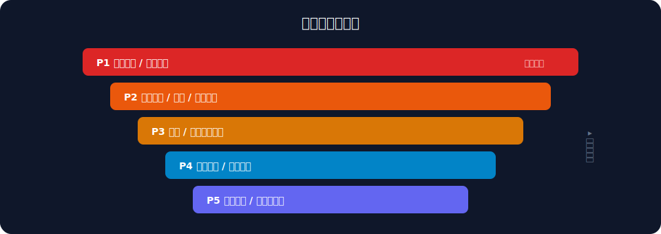
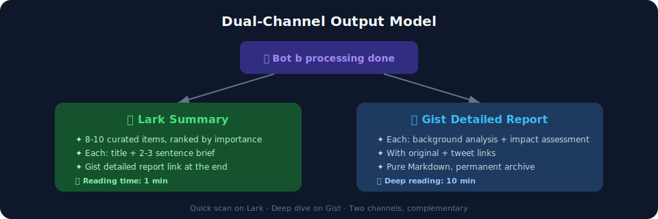
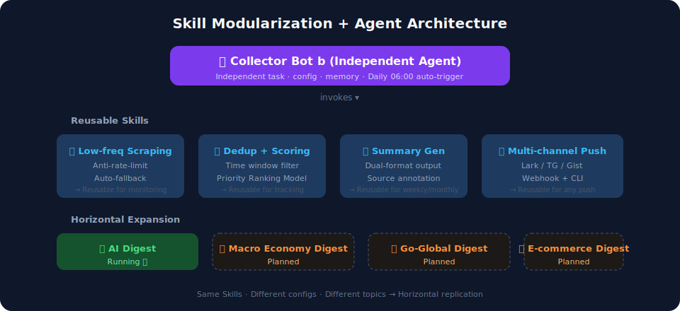
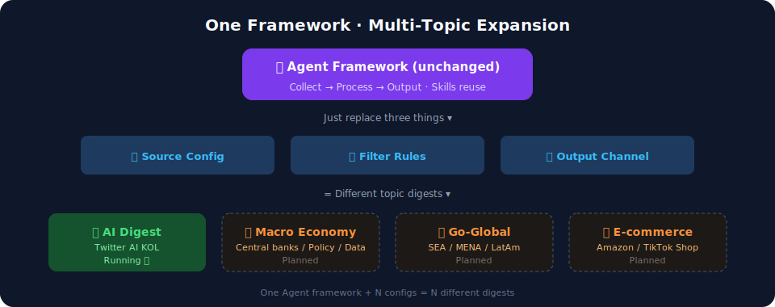

## TL;DR

I built a fully automated AI news digest using OpenClaw (a locally-running AI agent) + a Mac Mini. Every morning at 6AM, it scrapes Twitter and overseas tech media for the latest AI news, filters it down to 8-10 top stories, and pushes a summary to Lark with a detailed version on GitHub Gist.

More importantly, this isn't a hardcoded script. I modularized each capability into reusable Skills and wrapped the entire workflow into an independent sub-agent — "Collector Bot b." Swap in different sources and filters, and you get an entirely different daily digest.

---

## 1. Why Build Your Own?

### 1.1 What's Wrong with Existing Options

There's no shortage of AI news sources. But they all share a few pain points:

1. **Information lag**: Most Chinese media translates overseas news. By the time you read it, it's half a day to a full day old
2. **Too much noise**: Marketing fluff, reposts, and clickbait all mixed together — high filtering cost
3. **No structure**: Most digests are just a pile of headlines. You finish reading and don't know what actually matters

### 1.2 What I Wanted

- **First-hand overseas sources only** (Twitter KOLs + international tech media) — no second-hand translations
- Ranked by **importance**, not chronology
- Each item with a **2-3 sentence summary**, not just a headline
- **Auto-pushed at 6AM daily** — ready when I wake up
- A detailed version with **source links and analysis** for deeper reading

---

## 2. System Architecture

The system has three layers: collection, processing, and output.

### 2.1 Collection Layer: Three-Tier Sources

**Core — Twitter/X KOLs (~30 accounts):**

The fastest, most first-hand source. Organized by role:
- **Official accounts**: @OpenAI, @AnthropicAI, @GoogleDeepMind, @MistralAI, @xai, @huggingface
- **Industry leaders**: @sama, @karpathy, @AndrewYNg, @ylecun
- **News aggregators**: @rowancheung, @therundownai
- **Policy/opinion**: @GaryMarcus, @jackclarkSF

**Supplementary — International Tech Media:**

Catches what Twitter misses: TechCrunch / The Verge / Ars Technica / VentureBeat / SCMP / Rest of World

**Fallback — Brave Search:**

Fills gaps in specific areas (especially Chinese AI company news) using bilingual keywords.

### 2.2 Processing Layer: Filter + Rank

Raw information goes through three stages:

1. **Deduplication**: Compare against yesterday's digest, exclude already-covered stories
2. **Time window**: Keep only news from the past 24 hours
3. **Priority ranking**:

Filtering is equally important — strip out marketing fluff, low-value reposts, and loosely-related content. **What gets filtered out usually exceeds what stays.**

### 2.3 Output Layer: Dual-Channel Distribution

**Lark Summary (daily push):**
- 8-10 curated items, ranked by importance
- Each: headline + 2-3 sentence summary
- Gist link appended at the end
- Designed for a 1-minute scan

**GitHub Gist Detailed Report (permanent archive):**
- Each story: background analysis + impact assessment + source/tweet links
- Pure Markdown, readable online
- Auto-archived for future reference

---

## 3. Key Design Decisions

### 3.1 Anti-Rate-Limiting: Slow Is Better Than Broken

This was the biggest pitfall. Early on, we hit Twitter too aggressively and the account got locked.

Lessons learned, strict rules established:
- **Sleep 8-15 seconds** (randomized) after each API call
- Additional **60-90 second pause** every 3 calls
- Max **12 accounts** per run
- On any rate-limit signal, **immediately fall back** to media + search, and note it in the digest

### 3.2 Modular Skills

Instead of cramming all logic into one massive prompt, I broke each core capability into an independent Skill:

The benefit: each Skill can be iterated and reused independently. For example, the "low-frequency scraping + anti-rate-limiting" capability can be directly reused for sentiment monitoring or competitive tracking in the future.

### 3.3 Agent-ification: Collector Bot b

On top of modular Skills, I wrapped the entire digest workflow into an **independent sub-agent** — "Collector Bot b."

It has its own:
- **Task definition**: Triggered daily at 06:00
- **Source configuration**: Which KOLs, which media, which search terms
- **Filtering rules**: Priority ranking, dedup, noise filtering
- **Output format**: Lark summary + Gist detailed report

The point of making it independent: **swap in a different config, and you have a brand new digest agent.**

---

## 4. Horizontal Expansion

This architecture naturally supports multi-topic expansion. Keep the core workflow unchanged, just replace three things:

1. **Sources**: Swap in a different set of Twitter accounts + industry media
2. **Filtering rules**: Adjust priorities (e.g., in a macro digest, "central bank policy" gets top priority)
3. **Output channels**: Push to different Lark groups or Telegram channels

Topics already in planning:
- **Macro Economy Digest**: Fed / ECB / PBoC moves
- **Go-Global Digest**: Southeast Asia / Middle East / Latin America market dynamics
- **E-commerce Digest**: Amazon / Shopify / TikTok Shop trends

The ideal end state: **one agent framework + N configs = N different digests.**

---

## Takeaway

Building your own AI digest is really about answering one question: **of all the time you spend "keeping up with the industry," how much is just filtering noise?**

With a local agent, you can delegate the filtering and just consume the output. And because it runs locally, no data goes through third parties — you control the sources entirely.

But what's more valuable than "making a digest" is the thinking behind it: **modularize capabilities into Skills, wrap workflows into Agents, then replicate horizontally.** The daily digest is just the first application of this system.

---

*Written by Abe, organized by assistant a. System running daily.*
