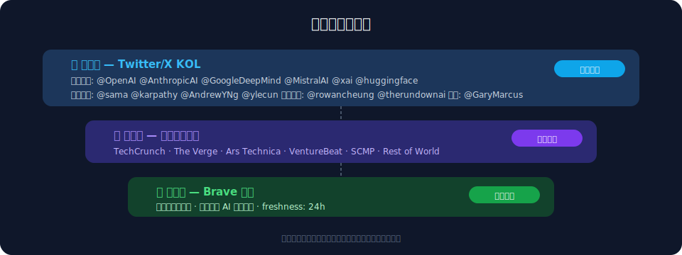
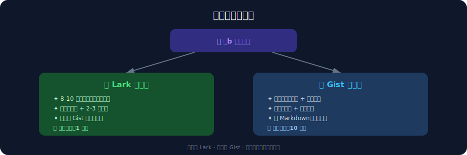
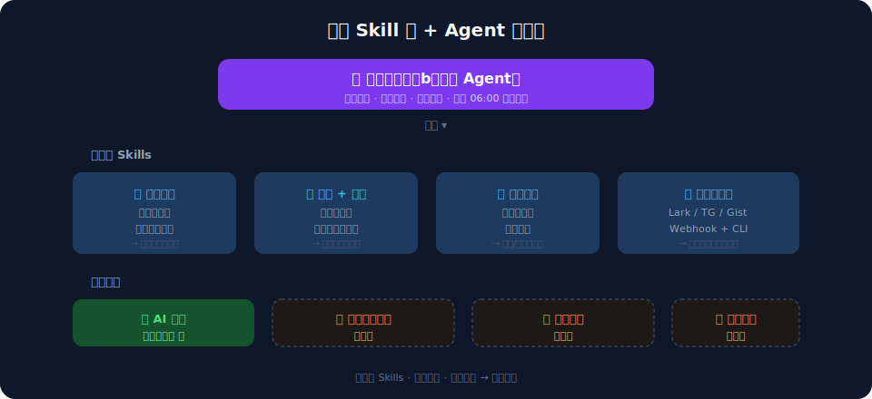
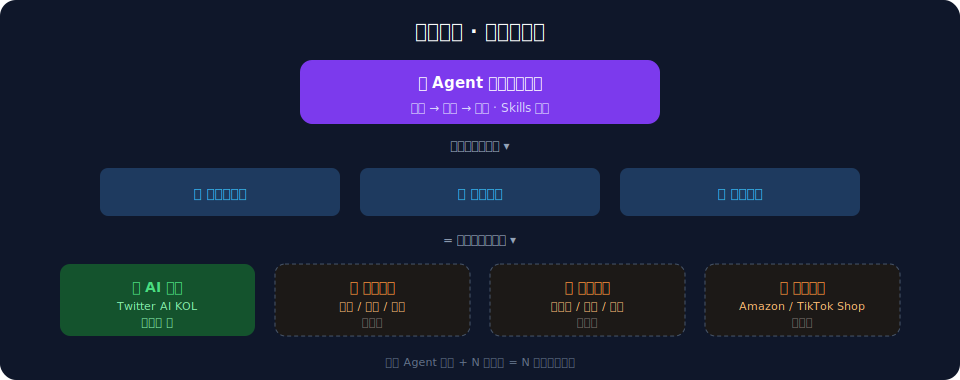

## 结论先行

我用 OpenClaw（一个跑在本地的 AI agent）+ Mac Mini，搭了一套全自动的 AI 日报系统。每天早上 6 点，它会自己去 Twitter 和海外媒体抓取最新的 AI 资讯，筛选出 8-10 条最重要的，生成摘要发到 Lark，详细版发到 GitHub Gist。

更重要的是，这套系统不是一个"写死的脚本"。我把它的每个能力都做成了可复用的模块（Skill），把整个工作流封装成了一个独立的子 Agent——"信息收集员小b"。这意味着换一组信息源和筛选规则，就能快速产出完全不同主题的日报。

---

## 1. 为什么要自建？

### 1.1 现有方案的问题

市面上不缺 AI 资讯来源，但有几个痛点：

1. **信息滞后**：国内媒体大多是翻译海外新闻，等你看到的时候，原始信息已经出了半天到一天
2. **噪音太多**：营销软文、重复搬运、标题党混在一起，筛选成本很高
3. **缺少结构**：大多数日报就是一堆标题堆在一起，看完不知道哪条重要

### 1.2 我想要的

- 只要**海外一手信息源**（Twitter KOL + 海外科技媒体），不要二手翻译
- 按**重要性排序**，不是按时间排序
- 每条新闻有 2-3 句**基础简介**，不是纯标题
- **每天 6 点自动推送**，醒了就能看
- 详细版有**来源链接和分析**，方便深入阅读

---

## 2. 系统架构

整套系统由三层组成：采集、处理、输出。

### 2.1 采集层：三级信息源

**核心层 — Twitter/X KOL（约 30 个账号）：**

最快、最一手的信息来源。按角色分了四类：
- **公司官方**：@OpenAI、@AnthropicAI、@GoogleDeepMind、@MistralAI、@xai、@huggingface
- **行业领袖**：@sama、@karpathy、@AndrewYNg、@ylecun
- **资讯聚合**：@rowancheung、@therundownai
- **观点/政策**：@GaryMarcus、@jackclarkSF

**补充层 — 海外科技媒体：**

覆盖 Twitter 遗漏的重要新闻：TechCrunch / The Verge / Ars Technica / VentureBeat / SCMP / Rest of World

**兜底层 — Brave 搜索：**

补充特定领域（尤其是中国 AI 公司动态），用中英文双语关键词搜索。

### 2.2 处理层：筛选 + 排序

采集回来的原始信息，经过三道处理：

1. **去重**：和昨天的日报对比，排除已报道的内容
2. **时间窗**：只保留过去 24 小时内的新闻
3. **优先级排序**：

过滤规则同样重要——去掉营销灌水、低信息量转发、弱相关内容。**过滤掉的往往比留下的多。**

### 2.3 输出层：双渠道分发

**Lark 摘要版（每天推送）：**
- 8-10 条，按重要性排序
- 每条：标题 + 2-3 句简介
- 末尾附 Gist 详细版链接
- 适合 1 分钟快速扫一遍

**GitHub Gist 详细版（永久存档）：**
- 每条新闻：背景分析 + 影响评估 + 原文/推文链接
- 纯 Markdown，可在线阅读
- 自动归档，方便回溯

---

## 3. 关键设计决策

### 3.1 防风控：宁可慢，不可断

这是整个系统里最大的坑。早期直接高频调 Twitter，结果账号被锁了。

教训之后，制定了严格规则：
- 每次调用后 **sleep 8-15 秒**（随机）
- 每 3 次调用后，额外 **sleep 60-90 秒**
- 单次最多抓取 **12 个账号**
- 一旦检测到风控信号，**立即降级**为媒体 + 搜索补充，并在日报中标注

### 3.2 能力 Skill 化

我没有把所有逻辑写死在一个大 prompt 里，而是把每个核心能力拆成了独立的 Skill：

这样做的好处是：每个 Skill 可以独立迭代、独立复用。比如"低频抓取 + 防风控"这个能力，未来做舆情监控、竞品追踪的时候可以直接拿来用。

### 3.3 Agent 化：信息收集员小b

在 Skill 化的基础上，我把整个日报工作流封装成了一个**独立的子 Agent**——"信息收集员小b"。

它有自己的：
- **任务定义**：每天 06:00 触发
- **信息源配置**：哪些 KOL、哪些媒体、哪些搜索词
- **筛选规则**：优先级排序、去重、过滤
- **输出格式**：Lark 摘要 + Gist 详细版

把它独立出来的意义在于：**换一套配置，就是一个全新的日报 Agent。**

---

## 4. 横向扩展的可能性

这套架构天然支持多主题扩展。核心工作流不变，只需要替换三样东西：

1. **信息源**：换一组 Twitter 账号 + 行业媒体
2. **筛选规则**：调整优先级（比如宏观日报里，"央行政策"优先级最高）
3. **输出渠道**：可以发到不同的 Lark 群或 Telegram channel

已经在规划中的主题：
- **宏观经济日报**：美联储 / ECB / 中国央行动态
- **出海日报**：东南亚 / 中东 / 拉美市场动态
- **电商日报**：Amazon / Shopify / TikTok Shop 趋势

最理想的状态是：**一个 Agent 框架 + N 套配置 = N 份不同的日报。**

---

## 小结

自建 AI 日报这件事，本质上是在回答一个问题：**你每天花在"了解行业动态"上的时间，有多少是在筛选噪音？**

有了本地 Agent，你可以把"筛选"交给它，自己只看结果。而且因为跑在本地，数据不经过第三方，信息源完全自己控制。

但比"做一个日报"更有价值的是背后的思路：**把能力 Skill 化，把工作流 Agent 化，然后横向复制。** 日报只是这套系统的第一个应用。

---

*本文由老杨口述 + 小a 整理。系统持续运行中，欢迎交流。*
